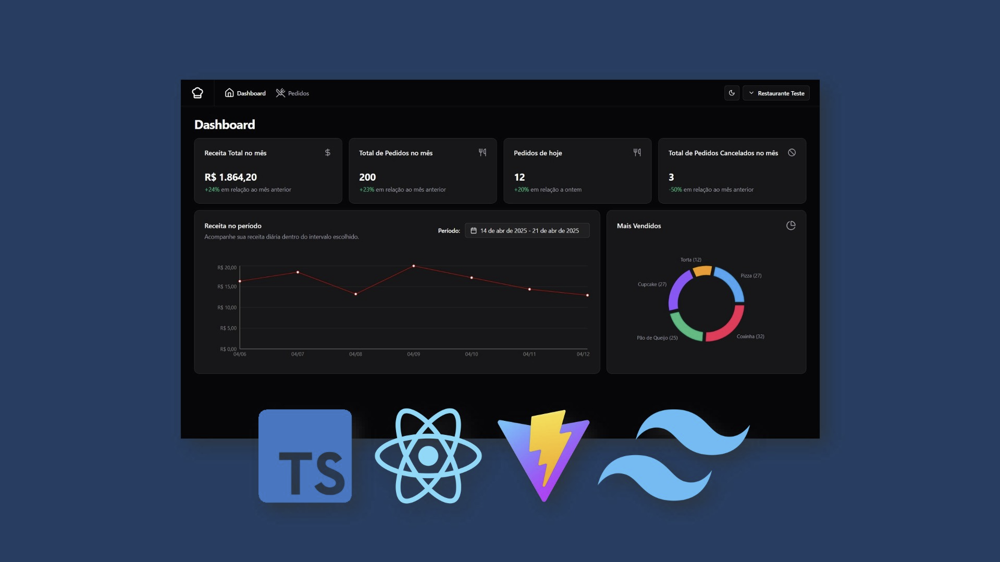
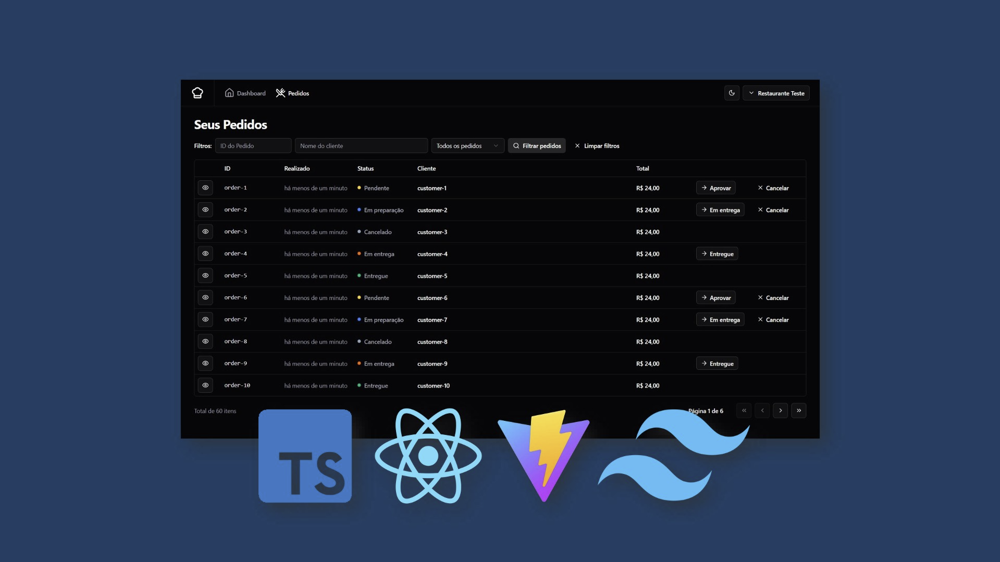
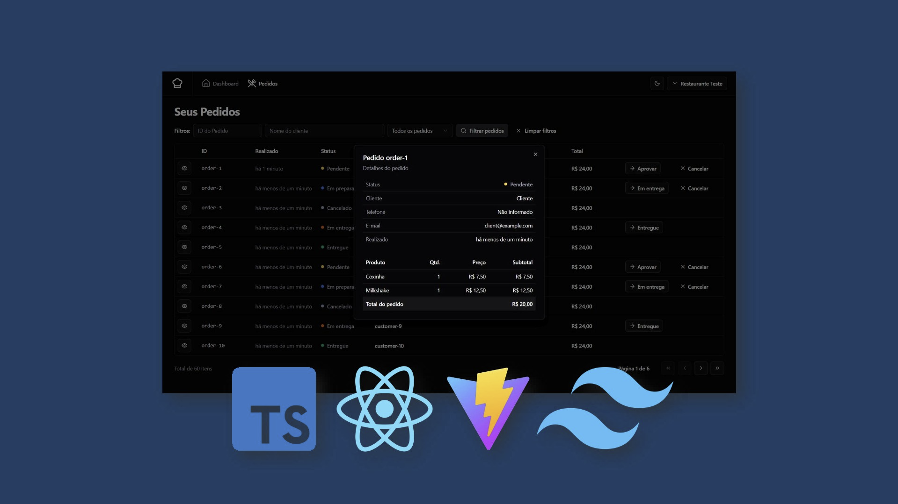
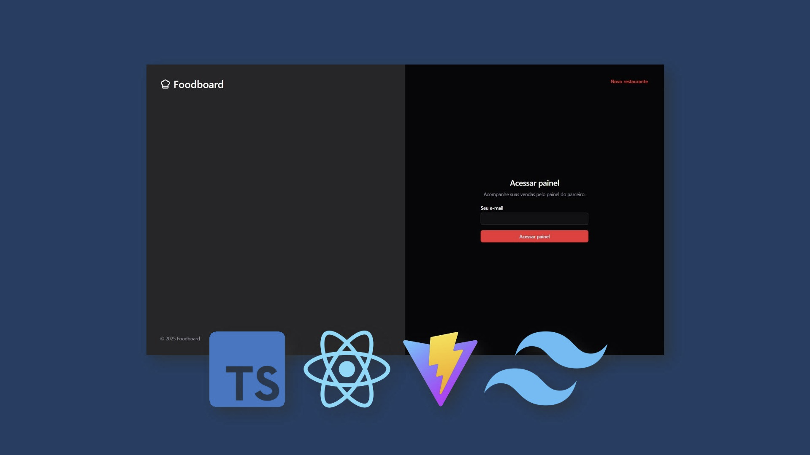
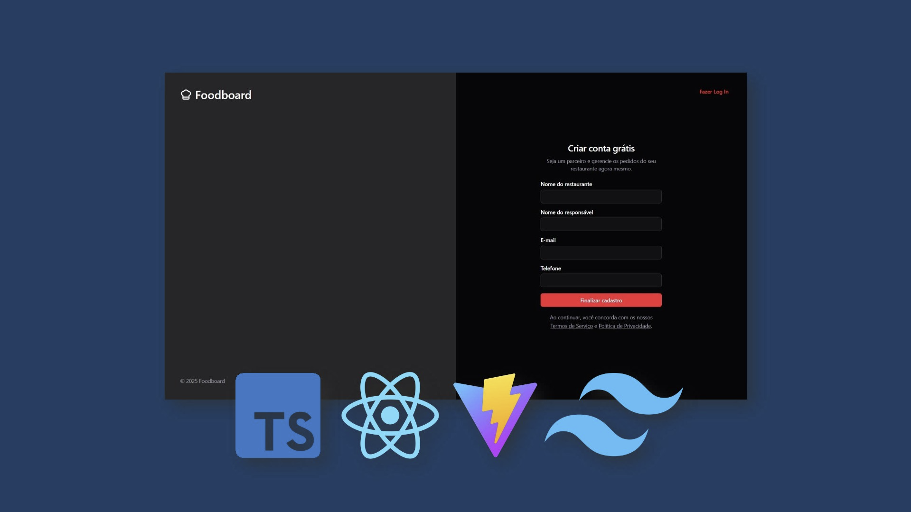

# FoodBoard - Restaurant Dashboard

FoodBoard is a full-stack restaurant management dashboard built as part of my front-end studies at Rocketseat. While the backend—powered by Bun—was provided by Rocketseat, my primary focus was on front-end architecture and implementation, creating a sleek and efficient interface for restaurant owners to track orders, manage business details, and oversee their operations.

## Features
### Authentication
- Sign-up: New users can create a restaurant profile, entering details such as:
    - Restaurant name
    - Responsible person's name
    - Email
    - Phone number
- Magic link sign-in: Secure access without needing a password.

### Dashboard
- Displays key restaurant metrics, including:
    - Total revenue for the month
    - Total orders processed
    - Orders placed today
    - Canceled orders count
- Interactive charts to visualize sales trends and most sold products.

### Orders Management
- View and manage incoming orders.
- Track and update order statuses: Pending, Processing, Delivering, Delivered, Canceled.
- Detailed breakdown of each order:
    - Product names, quantities, and prices
    - Customer details (email, phone number, and timestamps)
- Search and filter orders by ID or customer name.
- Approve, cancel, or mark orders as delivered.

### Customization
- Restaurant owners can update their restaurant name and description.

### Database & Testing
- The backend, provided by Rocketseat, is fully configured to support real-world database connections.
- Docker is used for containerized backend management.
- Mock data is leveraged for testing and local development.

## Technologies Used
- React.js – Component-based front-end development.
- TypeScript – Strong typing for better developer experience.
- Vite – Fast development and optimized build processes.
- Tailwind CSS – Utility-first styling for a clean, responsive UI.
- shadcn/ui – Modern UI component library.
- Resend – Handles email-based authentication.
- Zod – Data validation and form handling.
- Docker – Containerization for backend services.
- Testing Library – Unit & end-to-end tests for stability and predictable interactions.

## Project Gallery

  
  
  
  
  

## My Journey
This project was developed as part of my studies at Rocketseat, pushing me to refine my front-end architecture and state management strategies. Structuring a restaurant dashboard around real-time order tracking while maintaining fluid user interactions was an exciting challenge.

Customizing shadcn/ui, integrating data visualization tools, and managing interactive components strengthened my ability to build scalable, intuitive UIs. Implementing unit and end-to-end tests with Testing Library allowed me to design components that were more robust, ensuring a smooth and reliable user experience. Preparing the application for real-world database integration was a key milestone, ensuring the project is scalable and production-ready.
